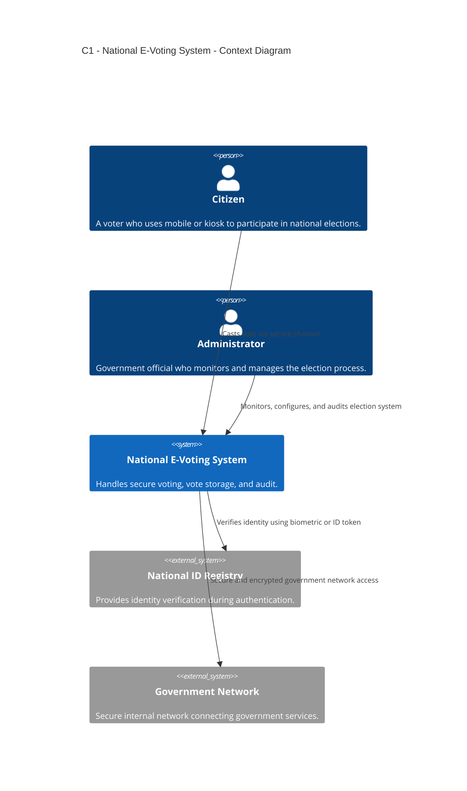
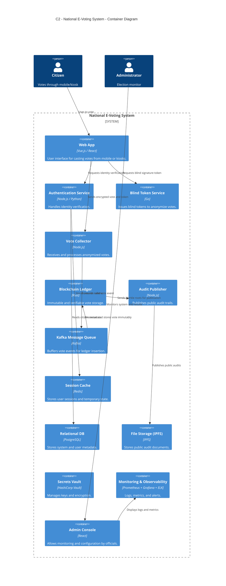

# 🗳️ National E-Voting System Design

---

## ✅ 1. Functional & Non-Functional Requirements

### 🔧 Functional Requirements
- Secure voter authentication using national ID or biometrics.
- Anonymous voting — identity decoupled from vote.
- One vote per eligible voter.
- Immutable vote storage with public audit logs.
- Access via personal devices and secure kiosks.
- Admin dashboards for real-time tracking and auditing.

### 🧪 Non-Functional Requirements

| Category           | Requirement                                                             |
|-------------------|--------------------------------------------------------------------------|
| **Scalability**    | Must support millions of voters concurrently                            |
| **Availability**   | 99.999% uptime during the 2-week election period                        |
| **Latency**        | P99 < 300ms for vote submission                                         |
| **Consistency**    | Strong consistency for vote ledger writes                               |
| **Anonymity**      | Complete decoupling of voter ID and vote content                        |
| **Fault Tolerance**| Multi-datacenter with vote buffering during outages                     |
| **Security**       | Encryption, secure hardware modules (HSM), intrusion detection systems  |
| **Auditability**   | Public ledger of vote hashes (Merkle Tree / Blockchain)                 |

---

## ⚖️ 2. Tradeoffs

| Feature                          | Tradeoff                                                             |
|----------------------------------|----------------------------------------------------------------------|
| Regional datacenters             | Improves latency, adds synchronization complexity                    |
| Blind signatures for anonymity   | Increased cryptographic complexity and performance cost              |
| Immutable blockchain ledger      | Storage and consensus overhead                                      |
| Public kiosk voting              | Physical maintenance and security challenges                         |
| Two-week voting window           | Simplifies load handling but increases operational uptime demands    |

---

## 🧩 3. Component Services

| Component              | Responsibility                                                      |
|------------------------|---------------------------------------------------------------------|
| **Auth Service**       | National ID verification, biometrics, token issuance                |
| **Token Service**      | Generates blind-signed anonymous tokens                             |
| **Vote Collector**     | Receives and validates votes, queues for write                      |
| **Vote Ledger (Blockchain)** | Commits votes immutably; produces public audit proofs             |
| **Audit Publisher**    | Publicly exposes Merkle tree roots or block hashes                  |
| **Admin Console**      | Vote monitoring, logs, statistics, anomaly detection                |
| **Kiosk Agent**        | Handles secure vote casting at public booths                        |
| **Message Queue (e.g., Kafka)** | Ensures reliable delivery of votes to backend systems           |
| **Monitoring Stack**   | Prometheus, Grafana, AlertManager for real-time visibility          |
| **Key Vault / HSM**    | Manages signing keys and secure cryptographic operations            |

---

## 🛢️ 4. Databases & Storage

| Database/Store              | Purpose                                      |
|-----------------------------|----------------------------------------------|
| **PostgreSQL / CockroachDB**| Voter authentication and token logs         |
| **IPFS / Distributed FS**   | Encrypted vote records, audit materials      |
| **Blockchain (custom or OSS)** | Vote ledger (append-only, verifiable)     |
| **Redis / Memcached**       | Temporary token cache and rate-limiting     |
| **ElasticSearch / Loki**    | Logging and traceability                    |

---

## 🔄 5. Data Flow (High-Level)





---

## 📦 6. API Specification (Draft)

### `/auth/login`
- `POST`: Auth via ID or biometric → returns temporary session

### `/token/issue`
- `POST`: Voter receives blind-signed token

### `/vote/submit`
- `POST`: Submit vote anonymously using token

### `/audit/proof`
- `GET`: Merkle root/hash proof for vote

### `/admin/dashboard`
- `GET`: Voting stats, errors, system health

---

## 🧱 7. Data Model & Analytics

### 📘 Data Models

#### `VoterSession`
```json
{
  "voter_id": "hashed_id",
  "authenticated_at": "timestamp",
  "region": "zone-a"
}
```

#### `VoteRecord`
```json
{
  "vote_hash": "sha256(...)",
  "token_id": "anon-token",
  "timestamp": "2025-10-10T14:32Z"
}
```

#### `Block`
```json
{
  "block_id": "UUID",
  "vote_hashes": [...],
  "timestamp": "...",
  "merkle_root": "..."
}
```

### 📈 Analytics

- Turnout % by region
- Token issuance failure rate
- Kiosk vs mobile vote share
- Audit log consistency checks
- Invalid vote attempts

---

## 🧰 8. Monitoring, Degradation & Fault Handling

### 🔔 Monitoring & Alerting

| Tool             | Metric/Alert                                      |
|------------------|---------------------------------------------------|
| Prometheus       | QPS, latency, error rates                         |
| Grafana          | Voting throughput dashboards                      |
| AlertManager     | DDoS patterns, high error rates, degraded nodes   |
| Loki / ELK       | Centralized logs (trace votes, debug issues)      |

### 🔧 Graceful Degradation

- Votes buffered in queue during blockchain delays
- Redundant Kiosk fallback to paper backup if network fails
- Token re-issuance after expiration/failure
- Read-only dashboards during DB failures

---

## 🧠 9. Complexity, Maintenance, and Cost

### 🔍 Complexity

- Cryptographic verification pipelines
- Byzantine fault tolerance across regional ledgers
- Multi-device vote casting + synchronization
- Secure kiosk management and OS hardening

### 🧹 Maintenance

- Key rotation policy post-election
- Blockchain archiving and validation
- Secure deletion of temporary caches
- Regular updates of kiosk firmware

### 💰 Cost Considerations

- Redundant infrastructure for every region
- Kiosk purchase and upkeep
- Cryptography hardware (HSM)
- Audit and certification expenses

---

## 🖼️ 10. Visuals to Include

- ✅ Component Diagram (Service + Data Store + Network)
- ✅ Data Flow Diagram
- ✅ Sequence Diagram for Vote Submission
- ✅ Blockchain Commit Process

---

## 🚨 11. Security Model

| Layer               | Control Mechanism                                       |
|---------------------|--------------------------------------------------------|
| Voter ID/Auth       | Government identity registry or biometric scan         |
| Token Anonymity     | Blind signatures, rate-limited issuance                |
| Vote Integrity      | Vote hash, timestamp, and signature                    |
| Ledger              | Append-only with Merkle proof or consensus chain       |
| Kiosk Security      | Secure boot, physical locks, OS monitoring             |
| Network             | TLS, VPN, firewall rules per region                    |
| Infra Trust Model   | Zero-trust access, MFA for admin                       |

---

## 🧪 12. Future Improvements

- Zero-knowledge proofs (zk-SNARKs) for vote inclusion
- Formal verification of vote path
- Decentralized validators via community observers
- QR-based paper audit trail integration
- Voice-based voting assistant for accessibility

---


```mermaid

```