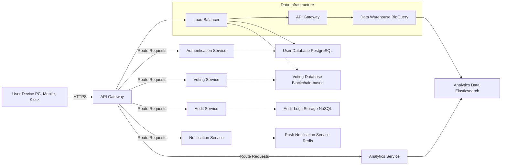
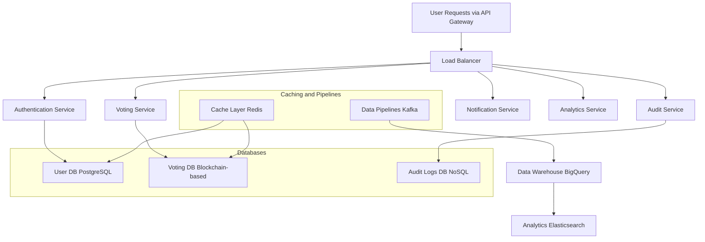
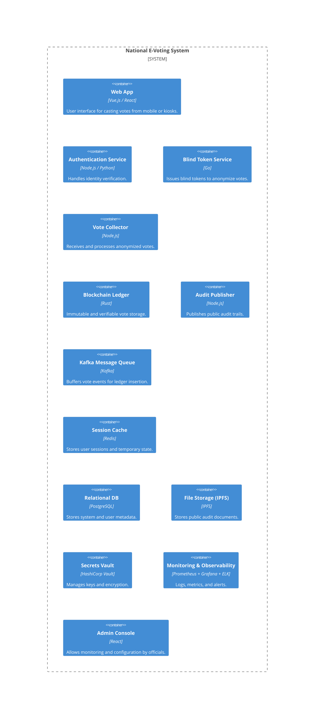

# National E-Voting System Design Document

## System Overview and Scope

The National E-Voting System is designed to enable secure, private, and verifiable electronic voting for citizens via web browsers and public kiosks. The goal is to replace or complement traditional paper-based voting with a digital alternative that maintains voter anonymity, prevents fraud, and supports large-scale participation.

### Key Features:
- Secure voter authentication
- Blind token issuance for vote anonymity
- Vote casting and submission
- Immutable vote storage using blockchain
- Real-time monitoring and auditing
- Public auditability via IPFS

### Scope:
**Included:**
- Frontend for citizens and administrators
- Authentication and token issuance services
- Vote submission and validation
- Blockchain-backed vote storage
- Public audit publishing
- Monitoring and metrics

**Excluded:**
- Biometric integration
- Offline voting mechanisms
- Internationalization/localization

---

## Functional and Non-Functional Requirements

### Functional Requirements:
- Citizens can authenticate and cast votes
- Tokens must be issued to enable anonymous voting
- System must verify and store encrypted votes
- Administrators must monitor election metrics
- Public can verify integrity of election via published audits

### Non-Functional Requirements:
- **Scalability:** Support up to 10 million users with concurrent vote casting.
- **Latency:** Vote submission must complete within 1 second.
- **Uptime:** System must maintain 99.99% availability during elections.
- **Security:** Must use TLS, encryption-at-rest, and hashing for sensitive data.

---

## High-Level Architecture

The system is composed of frontend applications, backend services, messaging infrastructure, and secure data stores.

---

## Component Breakdown

### Web App (Vue.js / React)
- Renders voting interface
- Sends authentication and vote requests

### Authentication Service (Node.js / Python)
- Verifies identity with citizen database
- Issues JWT and interacts with Redis cache

### Blind Token Service (Go)
- Provides blind signature tokens for vote anonymity

### Vote Collector (Node.js)
- Accepts encrypted votes
- Validates blind tokens
- Forwards valid votes to Kafka

### Blockchain Ledger (Rust)
- Stores vote hashes immutably
- Maintains audit trail

### Audit Publisher (Node.js)
- Publishes Merkle root hashes to IPFS

### Monitoring System
- Prometheus for metrics
- Grafana dashboards
- ELK stack for logging and auditing

---

## Data Storage and Database Schema

### PostgreSQL (Relational)
- Users Table (user_id, name, birthdate, region, status)
- Auth Sessions Table (session_id, user_id, issued_at, expires_at)

### Redis (In-Memory)
- Session tokens and ephemeral state

### Blockchain (Immutable Log)
- Vote Event (vote_id, hash, timestamp)

### IPFS (Audit Files)
- Published audit trail (Merkle tree JSON, metadata)

### Indexing & Performance
- PostgreSQL indexed on user_id and region
- Redis used for fast token validation
- Kafka partitions for scalable message ingestion

---

## Technology Stack Choices and Reasoning

| Layer | Technology | Reasoning |
|------|------------|-----------|
| Frontend | Vue.js / React | Component-based, fast development, responsive UI |
| Backend | Node.js, Go, Python | Async-friendly, fast prototyping, secure services |
| DB | PostgreSQL, Redis | Strong consistency, performance caching |
| Queue | Kafka | Scalable and fault-tolerant event streaming |
| Ledger | Custom Blockchain (Rust) | High performance and memory safety |
| Storage | IPFS | Decentralized and verifiable document storage |
| Security | Vault, HTTPS, JWT | Secrets management, encryption, token-based auth |
| Monitoring | Prometheus, Grafana, ELK | Observability and alerting stack |

---

## Non-Functional Design Discussions

### Scalability
- Stateless service instances behind load balancers
- Kafka enables asynchronous vote ingestion and decoupling
- PostgreSQL read replicas and Redis clustering
- IPFS nodes distributed across regions

### Security
- HTTPS for all communications
- OAuth2 and JWT-based sessions
- Blind signatures preserve anonymity
- Input sanitization and OWASP security checks
- Secrets stored in HashiCorp Vault

### Reliability
- Retry logic via Kafka and consumer groups
- Multiple replicas for DB and blockchain nodes
- Monitoring with alerts and auto-scaling triggers
- Audit logs stored immutably on IPFS

---

## Trade-offs and Limitations

### Monolith vs Microservices
- Chose microservices for separation of concerns, easier scaling, but higher deployment complexity

### SQL vs NoSQL
- Chose PostgreSQL for structured data and strong consistency. Could limit flexibility in unstructured expansions

### Blind Tokens vs Zero-Knowledge Proofs
- Simpler implementation with blind signatures but less robust than ZKPs

### Limitations
- No offline voting support in current scope
- Relies on network availability for all operations
- Assumes identity data from government is always accurate

---